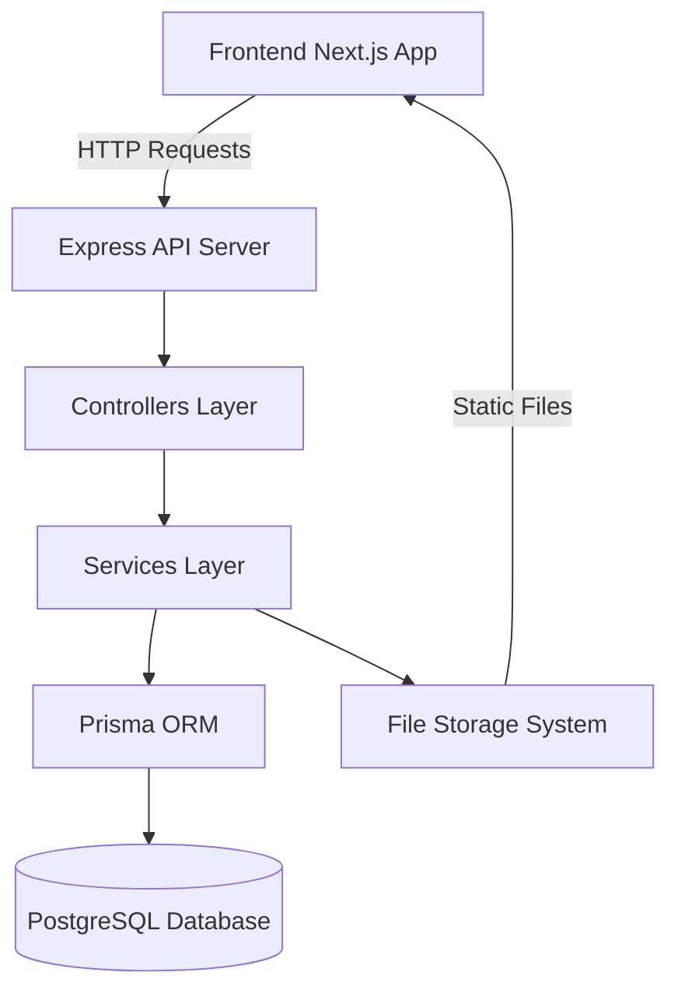

# Backend Integration - Technical Design

## Overview

This design document outlines the backend architecture for a real estate application that will replace static frontend data files with a dynamic database-backed API. The backend will be built using Node.js with Express, Prisma ORM for database management, and PostgreSQL as the database. The design preserves all existing field names and data structures from the frontend to ensure seamless integration.

### Goals

- Create a RESTful API that mirrors the existing frontend data structure
- Implement a Prisma schema that captures all entities and relationships
- Design a media upload system for property images and other assets
- Provide CRUD operations for all entities
- Maintain backward compatibility with frontend data consumption patterns

### Technology Stack

- **Runtime**: Node.js (v18+)
- **Framework**: Express.js
- **ORM**: Prisma
- **Database**: PostgreSQL
- **File Upload**: Multer
- **Validation**: Zod
- **Authentication**: JWT (for future admin operations)

## Architecture

### High-Level Architecture



### Directory Structure

```
backend/
├── src/
│   ├── controllers/       # Request handlers
│   ├── services/          # Business logic
│   ├── routes/            # API route definitions
│   ├── middleware/        # Express middleware
│   ├── utils/             # Helper functions
│   ├── validators/        # Request validation schemas
│   └── index.ts           # Application entry point
├── prisma/
│   ├── schema.prisma      # Database schema
│   └── migrations/        # Database migrations
├── uploads/               # Uploaded media files
└── tests/                 # Test files
```

### Layered Architecture

1. **Routes Layer**: Defines API endpoints and maps them to controllers
2. **Controllers Layer**: Handles HTTP requests/responses, delegates to services
3. **Services Layer**: Contains business logic, interacts with Prisma
4. **Data Access Layer**: Prisma ORM handles database operations
5. **Middleware Layer**: Authentication, validation, error handling

## Components and Interfaces

### Core Entities

Based on frontend data analysis, the following entities have been identified:

1. **Property** - Main real estate listings
2. **Agent** - Real estate agents
3. **Agency** - Real estate agencies
4. **Blog** - Blog posts and articles
5. **Category** - Property categories
6. **Location** - Geographic locations
7. **Project** - Real estate projects
8. **Service** - Services offered
9. **Testimonial** - Customer testimonials
10. **Job** - Career opportunities
11. **Gallery** - Image galleries
12. **HelpCenter** - Help center content

### API Endpoints

#### Properties API
```
GET    /api/properties              # List all properties (with pagination, filters)
GET    /api/properties/:id          # Get single property
POST   /api/properties              # Create property
PUT    /api/properties/:id          # Update property
DELETE /api/properties/:id          # Delete property
```

#### Agents API
```
GET    /api/agents                  # List all agents
GET    /api/agents/:id              # Get single agent
POST   /api/agents                  # Create agent
PUT    /api/agents/:id              # Update agent
DELETE /api/agents/:id              # Delete agent
```

#### Agencies API
```
GET    /api/agencies                # List all agencies
GET    /api/agencies/:id            # Get single agency
POST   /api/agencies                # Create agency
PUT    /api/agencies/:id            # Update agency
DELETE /api/agencies/:id            # Delete agency
```

#### Blogs API
```
GET    /api/blogs                   # List all blogs
GET    /api/blogs/:id               # Get single blog
POST   /api/blogs                   # Create blog
PUT    /api/blogs/:id               # Update blog
DELETE /api/blogs/:id               # Delete blog
```

#### Categories API
```
GET    /api/categories              # List all categories
GET    /api/categories/:id          # Get single category
POST   /api/categories              # Create category
PUT    /api/categories/:id          # Update category
DELETE /api/categories/:id          # Delete category
```

#### Locations API
```
GET    /api/locations               # List all locations
GET    /api/locations/:id           # Get single location
POST   /api/locations               # Create location
PUT    /api/locations/:id           # Update location
DELETE /api/locations/:id           # Delete location
```

#### Projects API
```
GET    /api/projects                # List all projects
GET    /api/projects/:id            # Get single project
POST   /api/projects                # Create project
PUT    /api/projects/:id            # Update project
DELETE /api/projects/:id            # Delete project
```

#### Services API
```
GET    /api/services                # List all services
GET    /api/services/:id            # Get single service
POST   /api/services                # Create service
PUT    /api/services/:id            # Update service
DELETE /api/services/:id            # Delete service
```

#### Testimonials API
```
GET    /api/testimonials            # List all testimonials
GET    /api/testimonials/:id        # Get single testimonial
POST   /api/testimonials            # Create testimonial
PUT    /api/testimonials/:id        # Update testimonial
DELETE /api/testimonials/:id        # Delete testimonial
```

#### Jobs API
```
GET    /api/jobs                    # List all jobs
GET    /api/jobs/:id                # Get single job
POST   /api/jobs                    # Create job
PUT    /api/jobs/:id                # Update job
DELETE /api/jobs/:id                # Delete job
```

#### Gallery API
```
GET    /api/gallery                 # List all gallery images
GET    /api/gallery/:id             # Get single gallery image
POST   /api/gallery                 # Create gallery image
PUT    /api/gallery/:id             # Update gallery image
DELETE /api/gallery/:id             # Delete gallery image
```

#### Media Upload API
```
POST   /api/upload                  # Upload single file
POST   /api/upload/multiple         # Upload multiple files
DELETE /api/upload/:filename        # Delete uploaded file
```

### Controller Interface Pattern

All controllers follow a consistent pattern:

```typescript
interface Controller {
  getAll(req: Request, res: Response): Promise<void>;
  getById(req: Request, res: Response): Promise<void>;
  create(req: Request, res: Response): Promise<void>;
  update(req: Request, res: Response): Promise<void>;
  delete(req: Request, res: Response): Promise<void>;
}
```

### Service Interface Pattern

Services encapsulate business logic:

```typescript
interface Service<T> {
  findAll(filters?: FilterOptions): Promise<T[]>;
  findById(id: number): Promise<T | null>;
  create(data: CreateDTO): Promise<T>;
  update(id: number, data: UpdateDTO): Promise<T>;
  delete(id: number): Promise<void>;
}
```

## Data Models

### Prisma Schema

```prisma
generator client {
  provider = "prisma-client-js"
}

datasource db {
  provider = "postgresql"
  url      = env("DATABASE_URL")
}

model Property {
  id          Int      @id @default(autoincrement())
  imageSrc    String
  title       String
  location    String
  beds        Int?
  baths       Int?
  sqft        String?
  price       Int
  long        Float?
  lat         Float?
  featured    Boolean  @default(false)
  forSale     Boolean  @default(true)
  category    String?
  rooms       Int?
  views       Int?
  garage      Int?
  date        String?
  postingDate String?
  expiryDate  String?
  agentAvatar String?
  agentName   String?
  imageWidth  Int?
  imageHeight Int?
  alt         String?
  delay       String?
  categories  String[] // Array of category names
  cities      String[] // Array of city names
  createdAt   DateTime @default(now())
  updatedAt   DateTime @updatedAt

  @@index([category])
  @@index([forSale])
  @@index([featured])
}

model Agent {
  id          Int      @id @default(autoincrement())
  imageSrc    String?
  image       String?
  name        String
  description String?
  role        String?
  delay       String?
  wowClass    String?
  createdAt   DateTime @default(now())
  updatedAt   DateTime @updatedAt

  @@index([name])
}

model Agency {
  id          Int      @id @default(autoincrement())
  bgImageSrc  String
  logoSrc     String
  name        String
  location    String
  listing     String
  hotline     String
  phone       String
  email       String
  createdAt   DateTime @default(now())
  updatedAt   DateTime @updatedAt

  @@index([name])
}

model Blog {
  id          Int      @id @default(autoincrement())
  imageSrc    String?
  imgSrc      String?
  tag         String
  date        String
  title       String
  description String?
  alt         String?
  createdAt   DateTime @default(now())
  updatedAt   DateTime @updatedAt

  @@index([tag])
  @@index([date])
}

model Category {
  id       Int      @id @default(autoincrement())
  name     String   @unique
  icon     String
  isActive Boolean  @default(false)
  listings String?  // e.g., "476 listings for sale"
  title    String?
  createdAt DateTime @default(now())
  updatedAt DateTime @updatedAt

  @@index([name])
}

model Location {
  id              Int      @id @default(autoincrement())
  imageSrc        String
  alt             String?
  city            String?
  title           String?
  propertiesCount String?
  properties      String?
  width           Int?
  height          Int?
  createdAt       DateTime @default(now())
  updatedAt       DateTime @updatedAt

  @@index([city])
  @@index([title])
}

model Project {
  id        Int      @id @default(autoincrement())
  imageSrc  String
  width     Int
  height    Int
  type      String
  title     String
  location  String
  bedrooms  Int?
  bathrooms Int?
  sqft      Int?
  price     Int?
  createdAt DateTime @default(now())
  updatedAt DateTime @updatedAt

  @@index([type])
}

model Service {
  id          Int      @id @default(autoincrement())
  icon        String
  imageSrc    String
  title       String
  description String
  delay       String?
  wowDelay    String?
  createdAt   DateTime @default(now())
  updatedAt   DateTime @updatedAt
}

model Testimonial {
  id           Int      @id @default(autoincrement())
  avatarSrc    String?
  avatar       String?
  description  String
  name         String
  role         String?
  location     String?
  rating       Int?
  width        Int?
  height       Int?
  avatarWidth  Int?
  avatarHeight Int?
  createdAt    DateTime @default(now())
  updatedAt    DateTime @updatedAt

  @@index([name])
}

model Job {
  id         Int      @id @default(autoincrement())
  title      String
  department String
  location   String
  salary     String
  animation  String?
  createdAt  DateTime @default(now())
  updatedAt  DateTime @updatedAt

  @@index([department])
  @@index([location])
}

model Gallery {
  id        Int      @id @default(autoincrement())
  src       String
  alt       String
  width     Int
  height    Int
  createdAt DateTime @default(now())
  updatedAt DateTime @updatedAt
}

model HelpCenter {
  id          Int      @id @default(autoincrement())
  imageSrc    String
  title       String
  description String
  delay       String?
  createdAt   DateTime @default(now())
  updatedAt   DateTime @updatedAt
}
```

### Media Upload System

#### File Storage Structure
```
uploads/
├── properties/       # Property images
├── agents/           # Agent photos
├── agencies/         # Agency logos and backgrounds
├── blogs/            # Blog post images
├── locations/        # Location images
├── projects/         # Project images
├── services/         # Service images
├── testimonials/     # Testimonial avatars
├── gallery/          # Gallery images
└── helpcenter/       # Help center images
```

#### Upload Configuration
- Maximum file size: 5MB per file
- Allowed formats: JPEG, PNG, WebP, GIF
- File naming: `{timestamp}-{randomString}-{originalName}`
- Image optimization: Automatic resizing and compression

#### Media Response Format
```typescript
interface MediaUploadResponse {
  success: boolean;
  url: string;
  filename: string;
  size: number;
  mimetype: string;
}
```

## Correctness Properties

*A property is a characteristic or behavior that should hold true across all valid executions of a system-essentially, a formal statement about what the system should do. Properties serve as the bridge between human-readable specifications and machine-verifiable correctness guarantees.*

